# Genpact's Enterprise Scale Landing Zone Implementation


This repository contains the code for Genpact's customized Cloud Adoption Framework Landing Zone implementation using Terraform.  Using a simple initial configuration, the module will deploy all the required infrastructure for Genpact's cloud adoption. Resources are split logically into the following capabilities.

  - Core Resources
    - Resource Group Creation for Platform resources for IND, NEU, EUS and WUS regions
    - Resource Group Creation for all Landing zone environments (TIS / TAS ) for Prod , Dev and UAT
    - Deployment of Management locks set at the Resource Group level for all RGs and configured for **CANNOT DELETE** setting
    - Resource group tagging as per the designed tags
  - Connectivity Resources
    - Deployment of virtual networks and subnets for all 3 regions for both platform and lanzing zone environments
    - Deployment of network security groups for all subnets (set to Deny_All by default)
    - Deployment of Azure Virtual WAN with connection to 4 hubs (IND / NEU / EUS / WUS)
    - Integration of regional Vnets and Landing Zone Vnets for each VWan Hub
  - Management Resources
    - Deployment of Azure Key Vault for both Prod and Dev for all regions
    - Deployment of Azure Key vault secrets for disk encryption
    - Deployment of Log Analytics workspace for al PROD regions
    - Deployment of storage accounts for all regions to be used for boot diagnostics
    - Deployment of Recovery Services vaults and Backup Policies for all regions

  - Server Infrastructure Resources
    - Deployment of Identiy servers ( Domain Contrillers, Okta servers) for all regions
    - Deployment of Logic Monitor servers and ZScaler servers for all regions


Detailed information how to deploy the infrastructure can be found below

## Pre requisites

1. A Azure virtual machine running Windows configured with managed identity with the following software installed:
  - [Visual Studio Code IDE](https://code.visualstudio.com/download)
  -  [Latest version of Terraform](https://www.terraform.io/downloads)
 -  [Git for Windows](https://gitforwindows.org/)
- Az Modules for Powershell
    ```
    Install-Module -Az
    ```
2. Managed Identity must have permission to deploy resources acros **all** Azure subscriptions to be deployed.


## Deployment Steps

1. Clone the repo to your Azure VM with managed identity configured

    ```
    git clone https://github.com/herms14/Genpact-Enterprise-Scale.git
    ```
2. Create a Azure Storage account for the backend state
      -  Open the code using **Visual Studio Code** and navigate to the **00 Pre Requisites >> Create-AzStorageAccount** folder
      - Under **terraform.tfvars** file, enter your Azure `subscription_id` where the storage account will be deployed.
      - Once storage account has been created, run the following Powershell code to fetch the storage account access keys and store it in a environmental variable on the machine

      ```
      $RESOURCE_GROUP_NAME = "<resource_group_name" #replace with your own resource group name
      $STORAGE_ACCOUNT_NAME = "storage_account_name" #replace with your own storage account name

      $ACCOUNT_KEY=(Get-AzStorageAccountKey -ResourceGroupName $RESOURCE_GROUP_NAME -Name $STORAGE_ACCOUNT_NAME)[0].value
      $env:ARM_ACCESS_KEY=$ACCOUNT_KEY
      ```
      To verify that access keys are stored, run `$env:ARM_ACCESS_KEY`on the console

3. Navigate to the **providers.tf** file under the **Genpact-Corp** folder and replace the following blocksvariables from the **provider backend** block

      ```
        backend "azurerm" {
        resource_group_name  = "<resource_group_name>"
        storage_account_name = "<storage_account_name>"
        container_name       = "<container_name>"
        key                  = "<filename of statefile.tfstate>"
      }
      ```

4. Replace the `subscription_ids` ubnder the **locals.tf** file for each corresponding platform and landing zone subscriptions.
5. Replace the `tenant_id` , `managed_identitiy_principal_id` and other variables you would like to customize under the **terraform.tfvars** file
6. Configure session for **managed identity**
    - Run the following code to store environmental variables to the local machine. **This is required in order for managed identity authentication to work**
      ```
      $env:ARM_USE_MSI="true"
      $env:ARM_TENANT_ID="<tenant_id>"
      $env:ARM_SUBSCRIPTION_ID="<any_subscription_id>"
      ```
7. Accept the **Marketplace Agreement** for ZPA server deployment. **This is required in order for the ZPA servers to be provisioned.**
      ```
      $Publisher = "zscaler"
      $Product = "zscaler-private-access"
      $Name = "zpa-con-azure"

      Get-AzMarketplaceTerms -Publisher $Publisher -Product $Product -Name $Name | Set-AzMarketplaceTerms -Accept
      ```
    Navigate to the Azure Portal and configure the **ZScaler** image from the **Marketplace** for Programmatic Deployment

    

7. Once all variables have been replaced and configured, run `terraform validate` to check for any syntax errors.
8. Generate the terraform plan by running `terraform plan` and review the resources to be created.
9. Deploy the code by running `terraform apply --auto-approve`. For faster deployment, you can deploy the resources in parallel by running `terraform apply --auto-approve -parallelism 50`
10. To destroy the resources on a test environment , execute `terraform destroy --auto-approve`
----------------------------


> Resources are designed to be deployed in parallel **EXCEPT** for **Backup-VMs.tf**. Make sure the VMs and Recovery services vaults are already existing before running the script.
----------------------------

## Resources Created

1. **Azure Virtual WAN components**

    **corp-vwan-ind-shared** VWan will be deployed under the **corp-rg-ind-prod-shared-connectivity-core-network** resource group with 4 hubs configured and regional vnets connections pointing to the hubs. Below is the architecture:


    
2.  **Virtual Machines and Storage Accounts per region**

  **CENTRAL INDIA Region**

  


  **North Europe Region**

   


   **EAST US Region**

  


  **WEST US 2 Region**

  


3. **Virtual Network Topology for all Regions**


  


